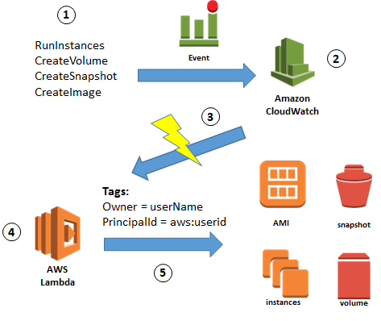
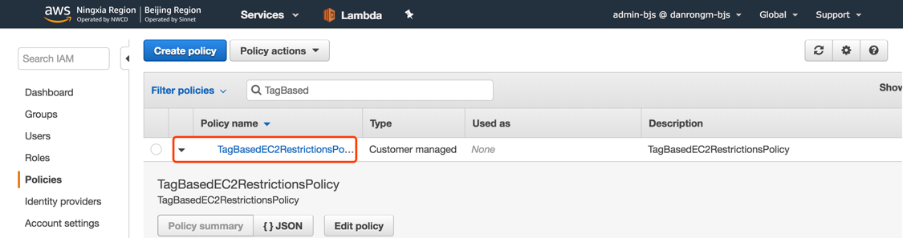
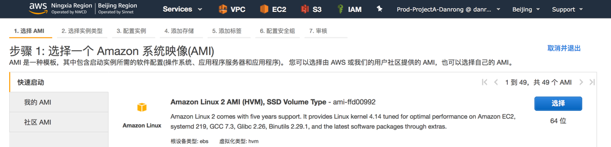
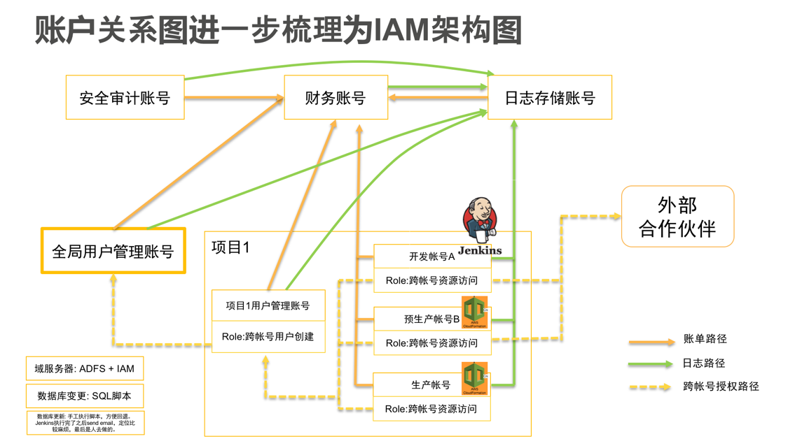

## AWS 资源自动打 Tag 方案

## 目的

当 EC2, EBS, Snapshot, AMI, RedShift 等资源创建之后，自动打上Tag，可以知道该资源是属于哪个项目的，
并且是由哪个IAM User创建的。大致流程图为:




## 原理

在 **CloudTrail **中会记录**大多数** API 操作，并标记为一个个**事件**，通过CloudWatch 可以通过设置**规则**来监听这些事件。

当事件发生时可以选择触发一个 **Lambda 函数**，依靠这个 Lambda 函数，我们可以针对这个事件执行各种操作。


> **注意**
>
> 1. 在创建 Lambda 函数时，保证 Lambda 函数的 角色（Role）**同时**拥有操作 **Lambda 函数**与**对应资源**的权限。
> 2. 大多数资源的 API 都可以在 [AWS 文档](https://amazonaws-china.com/cn/documentation/?nc2=h_ql_d&awsm=ql-5) 找到。但是，特别的，Lambda 在 CloudTrail 中记录的 API 名称与[Lambda 文档](https://docs.aws.amazon.com/zh_cn/lambda/latest/dg/API_Reference.html)中并不一致。在 [Lambda 样例代码](https://github.com/NageNalock/AWSAutoTag/tree/master/Lambda2Autotag)中给出了部分常用VPC API 名称。
> 3. 向 S3 中上传文件在**默认**状态下不会被 CloudTrail 记录，需要手动开启，参考[使用 AWS CloudTrail 数据事件为 S3 存储桶启用对象级别日志记录](https://docs.aws.amazon.com/zh_cn/AmazonS3/latest/user-guide/enable-cloudtrail-events.html)。
> 4. 若需对代码功能进行修改，建议先在各个服务的**独立代码目录**中阅读代码信息。

## **一、配置策略和 IAM 用户**

创建IAM Policy: TagBasedEC2RestrictionsPolicy


选择JSON格式


复制以下内容值JSON文本框 

```json
{
               "Version" : "2012-10-17",
               "Statement" : [
                   {
                       "Sid" : "LaunchEC2Instances",
                      "Effect" : "Allow",
                       "Action" : [
                           "ec2:Describe*",
                           "ec2:RunInstances"
                       ],
                       "Resource" : [
                           "*"
                       ]
                   },
                   {
                       "Sid" : "AllowActionsIfYouAreTheOwner",
                       "Effect" : "Allow",
                       "Action" : [
                           "ec2:StopInstances",
                           "ec2:StartInstances",
                           "ec2:RebootInstances",
                           "ec2:TerminateInstances"
                       ],
                       "Condition" : {
                           "StringEquals" : {
                               "ec2:ResourceTag/PrincipalId" : "${aws:userid}"
                           }
                       },
                       "Resource"  : [
                           "*"
                       ]
                   }
               ]
}
```

输入名称Policy名称，点击“创建策略”


策略创建成功



创建用户组“AutoTag-ManageEC2InstanceGroup”


输入组的名称


添加Policy


确认Policy添加成功


创建IAM User用户，格式为: “环境 - 项目 - 工程师姓名”。


把新创建的IAM User用户，添加到之前创建的用户组里面 


用户创建成功 


## 二、创建Lambda函数 


输入函数名称和选择运行时环境Python2.7 


```python
from __future__ import print_function
import json
import boto3
import logging
import time
import datetime

logger = logging.getLogger()
logger.setLevel(logging.INFO)

def lambda_handler(event, context):
    #logger.info('Event: ' + str(event))
    #print('Received event: ' + json.dumps(event, indent=2))

    ids = []

    try:
        region = event['region']
        detail = event['detail']
        eventname = detail['eventName']
        arn = detail['userIdentity']['arn']
        principal = detail['userIdentity']['principalId']
        userType = detail['userIdentity']['type']

        if userType == 'IAMUser':
            user = detail['userIdentity']['userName']

        else:
            user = principal.split(':')[1]

        logger.info('principalId: ' + str(principal))
        logger.info('region: ' + str(region))
        logger.info('eventName: ' + str(eventname))
        logger.info('detail: ' + str(detail))

        if not detail['responseElements']:
            logger.warning('Not responseElements found')
            if detail['errorCode']:
                logger.error('errorCode: ' + detail['errorCode'])
            if detail['errorMessage']:
                logger.error('errorMessage: ' + detail['errorMessage'])
            return False

        ec2 = boto3.resource('ec2')

        if eventname == 'CreateVolume':
            ids.append(detail['responseElements']['volumeId'])
            logger.info(ids)

        elif eventname == 'RunInstances':
            items = detail['responseElements']['instancesSet']['items']
            for item in items:
                ids.append(item['instanceId'])
            logger.info(ids)
            logger.info('number of instances: ' + str(len(ids)))

            base = ec2.instances.filter(InstanceIds=ids)

            #loop through the instances
            for instance in base:
                for vol in instance.volumes.all():
                    ids.append(vol.id)
                for eni in instance.network_interfaces:
                    ids.append(eni.id)

        elif eventname == 'CreateImage':
            ids.append(detail['responseElements']['imageId'])
            logger.info(ids)

        elif eventname == 'CreateSnapshot':
            ids.append(detail['responseElements']['snapshotId'])
            logger.info(ids)
        else:
            logger.warning('Not supported action')

        if ids:
            for resourceid in ids:
                print('Tagging resource ' + resourceid)
            ec2.create_tags(Resources=ids, Tags=[{'Key': 'Owner', 'Value': user}, {'Key': 'PrincipalId', 'Value': principal}])

        logger.info(' Remaining time (ms): ' + str(context.get_remaining_time_in_millis()) + '\n')
        return True
    except Exception as e:
        logger.error('Something went wrong: ' + str(e))
        return False
```

点击“创建函数”，Lambda创建成功。 


## 三、创建CloudWatch触发 


创建规则，Service Name选择EC2，Event Type选择“AWS API Call via CloudTrail”，Targets选择之前创建的Lambda函数。


设定打快照的规则 ，比如创建EC2、EBS、AMI、EBS Snapshot时候自动打Tag。


输入Rule的名称


## 四、启动EC2机器 



启动机器，当机器变成“Running”状态的时候，查看EC2的Tag，已经被自动打上去了。说明，这台机器是“生产”环境中，“ProjectA”项目，并且由IAM User用户“Danrong”创建的。当然，也可以按照需要，给EC2打多个Tag，比如三个Tag分别为: Environment-Prod, Owner-Danrong, Project-A，这样后续可以基于环境（比如Prod，Test）、IAM User用户（比如Zhangsan，Lisi）、或者项目（ProjectA，ProjectB）来区分billing。 


这样自动就可以了解到这台EC2实例是由什么环境、哪个项目，并且是由哪个用户创建的。 

同样的道理，创建EBS卷、EBS快照、AMI等资源都可以自动打上标签。 


具体EC2、VPC服务中的哪些资源可以在创建时自动打上标签请参考:

<https://docs.aws.amazon.com/zh_cn/AWSEC2/latest/UserGuide/Using_Tags.html>


## 五、使用AWS Organization服务




因此，可以通过AWS Organization服务解决多个AWS账号的分配和权限控制，通过自动打Tag的功能解决在一个AWS账号内，多个VPC之间明确资源的所属问题。之后新生产的账号都应该有AWS Master Account分配，开发、测试工程师登录到“管人”的账号，再Switch Role到开发、预生产、生产环境等部署资源的账号，开发、测试工程师并不能直接登录到“管资源”的账号。 

## 附录

当您在需要为其他资源( 如 RDS )或因其他情况( 如修改 EC2 实例类型 ) 而为资源打 Tag 时, 可参考附录中的代码.

附录中列举了部分常用资源的 **Lambda 函数**样例代码：

在资源被**创建**时为其打上形如 **{Owner：资源创建者，Principad：事件 ID}**  的 Tag 

此外，在各个服务的**独立代码目录**中还记录了 CloudWatch 监测到的事件**样例返回信息**（ Json 文件），作为修改代码逻辑时的参考信息。

### 整合代码

- [AWSAutotagTotal](./AWSAutotagTotal)

  整合后的代码文件，可在一份代码中为多个资源设置 Tag

### 独立代码目录

- [DynamoDBAutotag](./DynamoDBAutotag)

  单独为 DynamoDB 设置 Tag 及 DynamoDB  在  CloudWatch 中监测到的事件信息

- [Lambda2Autotag](./Lambda2Autotag)

  单独为 Lambda 设置 Tag 及 Lambda  在  CloudWatch 中监测到的事件信息

- [RDSAutotag](./RDSAutotag)

  单独为 RDS 设置 Tag 及 RDS  在  CloudWatch 中监测到的事件信息

- [RedShiftAutotag](./RedShiftAutotag)

  单独为 RedShift 设置 Tag 及 RedShift  在  CloudWatch 中监测到的事件信息

- [S3AutotagVObject](./S3AutotagVObject)

  单独为 S3 设置 Tag 及 S3  在  CloudWatch 中监测到的事件信息。

  特别的，分为对 S3 的**桶（bucket）** 设置 Tag 以及对 S3 中的 **对象（Object）** 设置 Tag

- [SQSAutotag](./SQSAutotag)

  单独为 SQS 设置 Tag 及 SQS  在  CloudWatch 中监测到的事件信息

- [VPCAutotag](./VPCAutotag)

  单独为 VPC 设置 Tag 及 VPC  在  CloudWatch 中监测到的事件信息